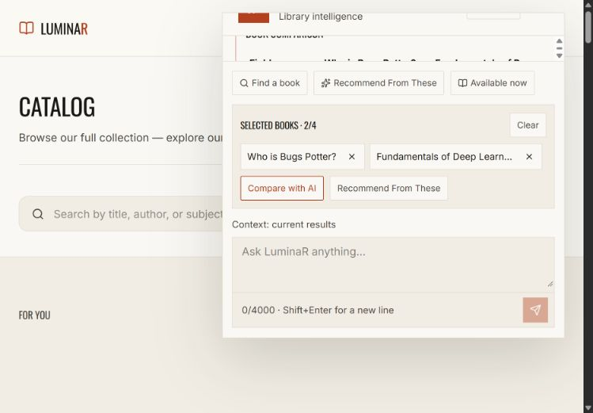

# LuminaR chatbot Part 2.5 — measured latency optimization

Completed 2026-10-01 in D:\SDC\LibraryLLM. Existing overlay retained. Stopped after Part 2.5.

## A. Bottleneck and original/optimized flow

Original: authenticated/validated request → Qwen intent → authoritative entity resolution → tools → usually Qwen prose → operational grounding → response serialization.

Optimized: same authentication/validation → allowed read-only action or small exact-message router → same authoritative resolver/tools → deterministic factual summary → serialization. Ambiguous input still invokes Qwen intent. General help and subjective/complex recommendation/comparison synthesis retain response Qwen. Accepted RAG routing/answer generation is unchanged; explicit source actions skip only assistant intent generation.

Search baseline: 50.99 s total, 13.80 s intent generation + 34.85 s prose generation, versus 1.96 s tool execution. Default recommendation: 27.70 s total, 26.70 s generation, versus 0.67 s tools. This verifies the model-pass hypothesis before changing routing behavior.

## B, H, I, J, P. Calls, before/after timing, improvement and real-service matrix

| Operation | Qwen before → after | Before s | After s | Improvement | Equivalent facts |
|---|---:|---:|---:|---:|---|
| search | 2 → 1 | 50.99 | 16.11 | 68.4% | yes |
| available_now | 1 → 0 | 16.67 | 3.26 | route changed¹ | no¹ |
| recommend_default | 2 → 0 | 27.70 | 0.98 | 96.4% | yes |
| recommend_one | 2 → 0 | 37.86 | 1.65 | 95.6% | yes |
| recommend_multiple | 2 → 0 | 53.04 | 2.72 | 94.9% | yes |
| compare | 2 → 0 | 37.29 | 0.38 | 99.0% | yes |
| availability | 2 → 0 | 26.56 | 0.34 | 98.7% | yes |
| fees | 2 → 0 | 17.07 | 0.36 | 97.9% | yes |
| loans | 2 → 0 | 16.12 | 0.36 | 97.8% | yes |
| reservations | 2 → 0 | 30.89 | 0.32 | 99.0% | yes |
| general | 2 → 2 | 26.19 | 24.04 | 8.2% | yes |
| book_rag | 1 → 0 | 46.97 | 0.79 | route changed¹ | no¹ |
| document_rag | 4 → 3 | 39.74 | 27.89 | 29.8% | yes |

Additional exact typed-message and authorized-reader matrix:

| Operation | Qwen before → after | Before s | After s | Improvement | Equivalent facts |
|---|---:|---:|---:|---:|---|
| book_rag_authorized | 1 → 2 | 46.46 | 7.34 | route changed¹ | no¹ |
| typed_recommend | 2 → 0 | 24.05 | 0.68 | 97.2% | yes |
| typed_compare | 2 → 0 | 37.52 | 0.35 | 99.1% | yes |
| typed_fees | 2 → 0 | 18.82 | 0.31 | 98.3% | yes |
| typed_loans | 2 → 0 | 28.93 | 0.31 | 98.9% | yes |

¹ Failed original routing is not a successful baseline. No percentage speedup is claimed for these non-equivalent results. Raw timings/calls remain visible. Standard comparison has identical catalogue facts but a deliberately changed requested-field list; see Q.

One representative request per scenario per phase; these are measured samples, not percentiles or an SLA. Same live Core/search/recommendation services and catalogue, same identity in matched runs, fresh conversation each time. Cached local model only; no model downloads, DB users, loans or mutations created. Main runs used the original in-memory process for baseline and restarted once for optimized behavior. Supplement baseline loads the frozen original orchestrator from the source snapshot, with timing wrappers only. Each run has one Qwen load, one worker and no reload; the previous service exits before the next starts.

## C. Routing and validation

Read-only request actions: COMPARE (2–4 unique selected IDs), RECOMMEND (zero selected), RECOMMEND_SIMILAR (one), RECOMMEND_FROM_SELECTION (2–4), CHECK_AVAILABILITY (one selected/page target), AVAILABLE_NOW, USER_LOANS, USER_FEES, USER_RESERVATIONS, BOOK_CONTENT_QUESTION (one selected/page book), DOCUMENT_QUESTION (document context required). Invalid counts clarify before model/tools. Unknown and mutating structured actions are rejected by the request schema. Every supplied book still reaches Core canonical validation; RAG still enforces existing source/borrow eligibility.

Exact typed routes normalize whitespace/case and terminal punctuation: recommend/recommend something/recommend me something; show my loans/what books do I have borrowed; do I have fines/show my fines; show my reservations; compare these/compare these two with 2–4 selected; is this available/is this book available with one selected/page book. More specific filters, names, quantities, ordinals or mixed/ambiguous requests retain Qwen extraction and the existing conversation resolver. Page availability binds that explicit target ahead of prior search results. Read-only action hints win over conflicting prose, but never over auth or confirmation requirements.

Frontend tray, quick recommendation, Available now, clicked-book availability and similar-recommendation buttons now send action plus canonical selections through the existing bearer client. Free text sends no action. Header, theme, drawer, loading state, scrollable history, input and layout code/styles are otherwise retained.

## D. Operations without Qwen

Explicit standard comparison, selection-driven/default recommendations, one-book availability, Available now and account summaries use zero calls. Exact typed recommendation/loans/fees/reservations/selected comparison/page availability also use zero. Natural-language search ordinarily uses one extraction call and no response call. Basic recommendation cards and comparison tables render verified structured values directly. Mutation proposals retain original intent extraction; their confirmation/disabled/cancel flow remains unchanged.

## E. Operations retaining Qwen

General help measured two calls (interpretation then explanation), unchanged. Ambiguous and complex natural language retains extraction; subjective comparison/complex recommendation wording conservatively retains prose. Ordinary book/document questions may require assistant extraction; explicit source actions omit it while accepted RAG still performs its own evidence validation and answer generation. Document RAG measured 4 → 3 calls. Authorized-book explicit RAG measured two existing RAG calls (validator/answer); the original assistant question clarified instead of entering RAG.

## F. Generation settings, budgets, stopping and prompt audit

No model generation settings changed. Assistant intent max_new_tokens=650, response=300, do_sample=False (temperature/top_p ignored), default num_beams=1, use_cache=True, structured repetition_penalty=1/no_repeat_ngram=0; existing AnswerRepetitionControl for prose. Pydantic validation plus at most one repair remains mandatory. Baseline intent outputs were 102–146 tokens including EOS, much below 650. The enforcer/tokenizer already permits normal EOS after a valid object; no measured substantial post-JSON continuation. Lowering a maximum that was never reached would not reduce these generations, and risks truncating richer valid intents. Prose ranged 13–283 tokens; removing those passes yields the substantial benefit without globally truncating explanations. Accepted RAG budgets, prompts and generation remain untouched.

Baseline intent input: 1,251–1,274 tokens; response input: 305–2,557 tokens. Intent includes bounded IDs/context/schema, no transcript. Recommendation synthesis sees only final displayed books (typically 10), not 50 candidates. Comparison payload is limited to selected 2–4 books; duplicate books in comparison/response and conversation IDs remain possible future prompt simplifications. Availability/account facts now avoid those prompts altogether. Existing description cap is 1,600 characters for response.books. No speculative prompt or decoding changes were kept.

## G. Attention/runtime and concurrency

Qwen2.5-3B-Instruct, CUDA NF4 4-bit/double quantization, FP16 compute. Model and tokenizer load at startup, including warm-up and immutable constrained-decoding vocabulary. No per-request from_pretrained, pipeline, quantization initialization or second Qwen. The existing single inference lock and one-slot executor remain; timed-out native generations retain their slot until they finish. ContextVar profiling is propagated into that executor and the existing RAG worker; it does not alter model tensors/settings.

Observed runtime: {"attention_backend": "luminar_sdpa", "torch": "2.11.0+cu128", "transformers": "5.15.1", "cuda": "12.8", "device": "cuda:0", "gpu": "NVIDIA GeForce RTX 5060 Laptop GPU", "flash_available": false, "sdpa_flash_enabled": true, "sdpa_mem_efficient_enabled": true, "model_resident_id": 2258814421712, "pid": 812}

Attention is already luminar_sdpa, the project’s Windows-compatible built-in SDPA wrapper with grouped K/V expansion. PyTorch reports fused flash attention unavailable on this build; SDPA memory-efficient kernels are enabled. Therefore no attention switch, dependency install, torch.compile or alternate engine was introduced. The existing RAG-specific attention choices remain untouched. Metadata fetches and seed recommendation requests still run concurrently. No new private/availability/Qwen-result cache was introduced; fresh facts remain authoritative. No unrelated GPU process was terminated.

## Independent stage and token observations

The JSON preserves request validation, intent routing/parsing, entity resolution, search, recommendation, aggregate Core metadata, availability, account, RAG, serialization, total and exact model call/token measurements. Final instrumentation additionally separates intent_json_validation and core_metadata_wall. Model generation times below are exact model-call wall times; intent parsing is inclusive of generation/setup/validation. Stages nest and concurrent Core timings overlap, so do not add all columns to estimate total. Remaining total includes authentication/dependency execution, per-request HTTP client setup, scheduling and transport; these have not been individually isolated.

| Phase/operation | Intent generation ms | Tool wall ms | Prose generation ms | RAG generation ms | Input tokens | Output tokens | Serialization ms |
|---|---:|---:|---:|---:|---:|---:|---:|
| before/search | 13798.1 | 1958.0 | 34847.7 | 0.0 | 2951 | 388 | 4.12 |
| before/available_now | 16365.4 | 0.2 | 0.0 | 0.0 | 1255 | 121 | 1.44 |
| before/recommend_default | 13694.5 | 666.7 | 13008.4 | 0.0 | 2948 | 206 | 2.58 |
| before/recommend_one | 23318.4 | 1708.9 | 12486.3 | 0.0 | 3055 | 211 | 0.33 |
| before/recommend_multiple | 36815.2 | 3075.0 | 12801.9 | 0.0 | 3829 | 243 | 0.34 |
| before/compare | 34172.0 | 50.0 | 2750.0 | 0.0 | 3282 | 150 | 0.26 |
| before/availability | 24431.8 | 28.4 | 1795.5 | 0.0 | 1760 | 131 | 0.18 |
| before/fees | 13800.7 | 13.6 | 2951.3 | 0.0 | 2169 | 126 | 1.66 |
| before/loans | 13348.6 | 40.5 | 2437.9 | 0.0 | 1567 | 120 | 0.18 |
| before/reservations | 13840.2 | 11.7 | 16733.4 | 0.0 | 2298 | 236 | 0.18 |
| before/general | 14491.7 | 0.0 | 11381.7 | 0.0 | 1559 | 199 | 1.90 |
| before/book_rag | 26174.4 | 20484.3 | 0.0 | 0.0 | 1268 | 125 | 0.16 |
| before/document_rag | 14243.0 | 25179.5 | 0.0 | 25048.0 | 4098 | 288 | 3.58 |
| after/search | 14642.8 | 1090.1 | 0.0 | 0.0 | 1255 | 105 | 2.35 |
| after/available_now | 0.0 | 2978.4 | 0.0 | 0.0 | 0 | 0 | 1.59 |
| after/recommend_default | 0.0 | 691.9 | 0.0 | 0.0 | 0 | 0 | 0.20 |
| after/recommend_one | 0.0 | 1356.9 | 0.0 | 0.0 | 0 | 0 | 0.36 |
| after/recommend_multiple | 0.0 | 2332.5 | 0.0 | 0.0 | 0 | 0 | 0.25 |
| after/compare | 0.0 | 46.8 | 0.0 | 0.0 | 0 | 0 | 0.31 |
| after/availability | 0.0 | 33.1 | 0.0 | 0.0 | 0 | 0 | 0.22 |
| after/fees | 0.0 | 13.4 | 0.0 | 0.0 | 0 | 0 | 1.68 |
| after/loans | 0.0 | 42.9 | 0.0 | 0.0 | 0 | 0 | 0.16 |
| after/reservations | 0.0 | 13.1 | 0.0 | 0.0 | 0 | 0 | 0.20 |
| after/general | 15137.7 | 0.0 | 8531.7 | 0.0 | 1564 | 176 | 1.64 |
| after/book_rag | 0.0 | 488.1 | 0.0 | 0.0 | 0 | 0 | 1.91 |
| after/document_rag | 0.0 | 27597.0 | 0.0 | 27449.5 | 2831 | 182 | 4.06 |
| before supplementary/book_rag_authorized | 28508.5 | 17589.9 | 0.0 | 0.0 | 1270 | 133 | 2.01 |
| before supplementary/typed_recommend | 14420.2 | 1784.0 | 7537.3 | 0.0 | 2887 | 159 | 2.34 |
| before supplementary/typed_compare | 34347.2 | 45.0 | 2804.2 | 0.0 | 3283 | 150 | 0.21 |
| before supplementary/typed_fees | 15553.2 | 15.3 | 2918.6 | 0.0 | 1579 | 127 | 0.48 |
| before supplementary/typed_loans | 14048.3 | 34.7 | 14541.2 | 0.0 | 2168 | 215 | 1.75 |
| after supplementary/book_rag_authorized | 0.0 | 7012.0 | 0.0 | 5983.9 | 6598 | 33 | 5.78 |
| after supplementary/typed_recommend | 0.0 | 398.1 | 0.0 | 0.0 | 0 | 0 | 0.17 |
| after supplementary/typed_compare | 0.0 | 53.1 | 0.0 | 0.0 | 0 | 0 | 0.14 |
| after supplementary/typed_fees | 0.0 | 36.0 | 0.0 | 0.0 | 0 | 0 | 0.17 |
| after supplementary/typed_loans | 0.0 | 31.1 | 0.0 | 0.0 | 0 | 0 | 0.11 |

## K. GPU/RAM observations

Baseline: process RSS 1353–1404 MiB; CUDA allocated 2162–2172 MiB; CUDA reserved up to 2700 MiB.

Optimized main: process RSS 1360–1464 MiB; CUDA allocated 2162–2172 MiB; CUDA reserved up to 2496 MiB.

Optimized supplementary: process RSS 1631–1631 MiB; CUDA allocated 2162–2162 MiB; CUDA reserved up to 2780 MiB.

nvidia-smi during baseline startup/measurement showed 3,109 MiB total GPU usage on an 8,151 MiB RTX 5060 Laptop GPU. Torch allocations describe this process, whereas nvidia-smi includes drivers/other apps; these are request snapshots, not a controlled peak-memory benchmark. No memory reduction claim is made.

## L. Files and preservation

Existing source changes:
- `assistant/api.py`
- `assistant/orchestrator.py`
- `assistant/qwen.py`
- `assistant/schemas.py`
- `assistant/tools.py`
- `frontend/src/components/AIChatWidget.tsx`
- `frontend/src/components/assistant/AssistantTurn.tsx`
- `frontend/src/lib/assistant.ts`
- `frontend/src/lib/assistantTypes.ts`
- `frontend/tests/assistant.test.tsx`
- `tests/test_assistant_backend.py`
- `.env.assistant.example`

New source and configuration:
- `assistant/profiling.py`
- `assistant/routing.py`
- `tests/test_assistant_latency.py`
- `scripts/benchmark_assistant_latency.py`
- `scripts/run_assistant_latency_service.py`
- `scripts/report_assistant_latency.py`

Source snapshot/hash inventory: assistant_latency_source_baseline/hashes.json. Review diff: assistant_latency_source.diff. Preservation report: assistant_latency_source_preservation.json. 165 baseline source/configuration files checked; all 96 Core/RAG/recommendation/search source files unchanged. The original 163 code files were copied before instrumentation; original backend fixture/env content was reconstructed from verified pre-edit lines for complete diffs. Existing experimental/protected RAG hash and route-AST checks pass. No recommendation weights, retrieval/chunks/indexes, model loader, experimental files or G1/G2/G3/R0 artifacts edited. Repository has no Git metadata, so a source snapshot/unified diff records the work. The two existing fixture requests were made semantically explicit: requested five books now says “Recommend 5 books”; the Qwen timeout case now uses ambiguous wording so it actually reaches the fallback being tested.

## M. Focused backend tests

117 passed = existing 68 plus 49 parametrized latency/security/observation cases. All 20 requested named fast-path tests are present. Covers skipped intent/prose calls, subjective fallback, exact typed gates, invalid counts/actions, real authoritative IDs, auth, owner/confirmation safety, source dispatch, page target vs prior results, conflicting prose/action and exact privacy-safe observation. See assistant_latency_tests.xml.

## N. Frontend tests/build

92 passed = original 87 plus five action-payload checks. Existing bearer/session/error/security/selection/keyboard/axe behavior remains covered. TypeScript/Vite production build passed. oxlint passed with the same 18 prior warnings. See assistant_latency_frontend_tests.log, assistant_latency_frontend_build.log and assistant_latency_frontend_lint.log.

## O. Backend regressions

203 passed, 10 skipped (pre-existing isolated Mongo opt-in tests), one existing Starlette/httpx deprecation warning. Combined assistant, latency, book-access, dynamic capabilities and staff-auth suites passed. See assistant_latency_regressions.xml.

## Q. Correctness differences and equivalence

- Available now: original Qwen classified availability without a unique target and clarified; explicit AVAILABLE_NOW now returns verified available-only search results.
- Standard compare: original Qwen inserted unrequested page_count, yielding a missing-field notice. Explicit COMPARE returns the same actual books/availability with no invented requested field.
- Unindexed book RAG: original extraction clarified; explicit book action reaches the existing RAG authorization/source gate and receives HTTP_404. No source or borrowing bypass.
- Authorized book RAG: original Qwen extracted unsuitable entities and clarified; explicit action binds the actual selected/borrowed indexed book and returns SUPPORTED with seven sources. This is a routing correction, not an equivalent-result latency gain.
- Simple prose is now deterministic; general-help prose can vary with conversation IDs, as before. Document RAG answer/verdict/sources are identical.

Structured digests include intent, canonical books/metadata/order, seeds, recommendation mode, availability, account and errors. Account hashes avoid retaining private rows. RAG digest compares answer/verdict/sources, excludes timings/profiles. Ten successful non-RAG cases plus document RAG have equal fact digests. Standard comparison requested_fields is separately audited rather than hidden in a broad equivalence claim. Quantities, unsupported constraints and subjective wording still fall through to the existing extraction/clarification paths. Authentication, source access, fresh availability and confirmation guards remain authoritative.

## R. Limitations and future work

Sampling is one paired observation per scenario; device thermals, background load, transport and generated wording vary. General help/ambiguous/subjective tasks remain model-bound and may require two passes. Typed availability with multiple candidates/ordinals or explicit unresolved titles still uses Qwen and the existing resolver. Available now filters the existing bounded search candidate list; it is not an exhaustive inventory listing. Selection/document actions establish only routing, not unrestricted book content access.

Future work should separately evaluate an explicit optional explanation operation, smaller redundant synthesis payloads (especially duplicate comparison books/conversation IDs), representative latency distributions and an independently validated single-pass general-help design. Consider metadata batching only with fresh availability separated. Keep model budget/attention changes behind controlled correctness benchmarks. These are recommendations, not implemented Part 3 work.

## Real existing-overlay verification

The real Compare with AI button in the existing catalogue overlay rendered actual selected metadata with zero model calls: 443 ms browser latency (432.9 ms server); later repeat 371 ms. No browser warnings/errors. Selection controls, authenticated existing client, comparison response and overlay all exercised end-to-end. Temporary review bootstrap removed and browser restored signed out; no account/loan/reservation was created. Single optimized 8005 service remains available alongside the reused Core/search/recommendation services and existing Vite server.



## S. Exact commands

From stopped services, use separate PowerShell terminals for each server; the current local services are already running.

```powershell
Set-Location 'D:\SDC\LibraryLLM'
.\.venv\Scripts\python.exe -m uvicorn backend.main:app --host 127.0.0.1 --port 8002 --workers 1
```

```powershell
Set-Location 'D:\SDC\LibraryLLM'
.\.venv\Scripts\python.exe -m uvicorn search.api:app --host 127.0.0.1 --port 8003 --workers 1
```

```powershell
Set-Location 'D:\SDC\LibraryLLM'
.\.venv\Scripts\python.exe -m uvicorn recommendation.api:app --host 127.0.0.1 --port 8004 --workers 1
```

```powershell
Set-Location 'D:\SDC\LibraryLLM'
$env:ASSISTANT_ENABLED='true'
$env:ASSISTANT_MUTATING_ACTIONS_ENABLED='false'
$env:LUMINAR_MOCK_LLM='0'
$env:LUMINAR_DEBUG_PROMPT='0'
# Optional numeric-only profiling:
# $env:ASSISTANT_PROFILE_PATH='D:\SDC\LibraryLLM\reports\assistant_request_profiles.jsonl'
.\.venv\Scripts\python.exe -m uvicorn rag.api:app --host 127.0.0.1 --port 8005 --workers 1
```

```powershell
Set-Location 'D:\SDC\LibraryLLM\frontend'
npm run dev -- --host 127.0.0.1
```

Validation:

```powershell
Set-Location 'D:\SDC\LibraryLLM'
.\.venv\Scripts\python.exe -m pytest tests\test_assistant_backend.py tests\test_assistant_latency.py -q
.\.venv\Scripts\python.exe -m pytest tests\test_assistant_backend.py tests\test_assistant_latency.py tests\test_book_access_control.py tests\test_dynamic_book_capabilities.py tests\staff_auth\test_auth.py -q
Set-Location 'D:\SDC\LibraryLLM\frontend'
npm test
npm run build
npm run lint
```

The benchmark harness refuses an occupied 8005 before starting a model and reuses 8002–8004. The frozen runner is only for reproducing the original baseline. Reports include raw failed routes without falsely labeling them successful speedups.
